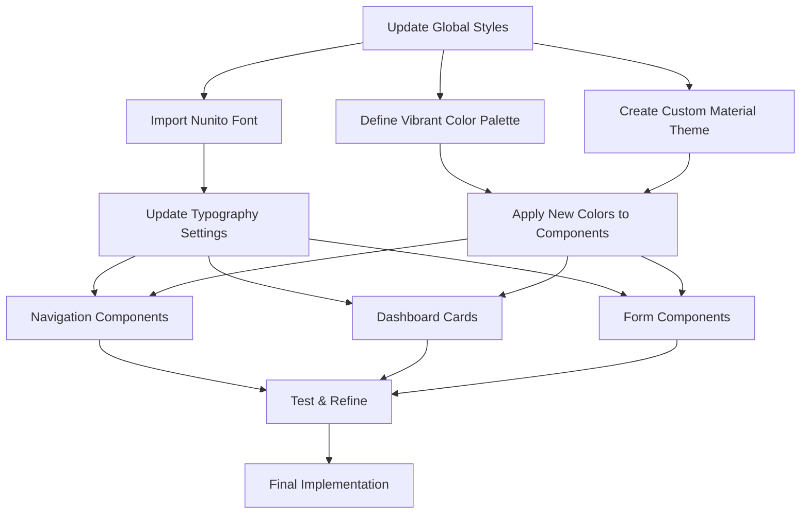

# Font Style and Color Modernization Plan

This document outlines the plan for modernizing the font style and colors in the CRM application to create a more compact and modern aesthetic with improved readability and vibrant colors.

## 1. Global Typography and Color Updates

### 1.1 Update Main Styles File (`styles.scss`)

We'll modify the `styles.scss` file to:
- Replace Roboto with Nunito font
- Adjust font sizes and line heights
- Update the color palette with more vibrant colors

**Current Code:**
```scss
@use '@angular/material' as mat;
@import '@angular/material/prebuilt-themes/indigo-pink.css';

$primary-color: #003366;
$accent-color: #0077be;
$background-color: #f0f0f0;
$text-color: #333333;
$border-color: #cccccc;

@include mat.core();

/* Global styles */
html, body { 
  height: 100%; 
  margin: 0; 
  font-family: Roboto, "Helvetica Neue", sans-serif;
  background-color: $background-color;
  color: $text-color;
}

body { 
  font-size: 14px;
  line-height: 1.5;
}
```

**Updated Code:**
```scss
@use '@angular/material' as mat;
@import url('https://fonts.googleapis.com/css2?family=Nunito:wght@300;400;500;600;700&display=swap');

// Updated vibrant color palette
$primary-color: #0055ff; // Vibrant blue (was #003366)
$accent-color: #00c2ff; // Bright cyan (was #0077be)
$background-color: #f8f9fa; // Lighter background (was #f0f0f0)
$text-color: #212529; // Slightly darker for better contrast (was #333333)
$border-color: #dee2e6; // Slightly lighter (was #cccccc)
$success-color: #00d97e; // Vibrant green
$warning-color: #ffab00; // Vibrant amber
$error-color: #ff3d71; // Vibrant red

@include mat.core();

/* Global styles */
html, body { 
  height: 100%; 
  margin: 0; 
  font-family: 'Nunito', sans-serif;
  background-color: $background-color;
  color: $text-color;
}

body { 
  font-size: 14px;
  line-height: 1.6; // Improved line height for readability
  letter-spacing: 0.01em; // Slight letter spacing for modern look
}
```

### 1.2 Create a Custom Angular Material Theme (`custom-theme.scss`)

We'll create a new file `custom-theme.scss` in the `src` directory:

```scss
@use '@angular/material' as mat;

// Define custom palettes
$custom-primary: mat.define-palette((
  50: #e3f2fd,
  100: #bbdefb,
  200: #90caf9,
  300: #64b5f6,
  400: #42a5f5,
  500: #0055ff, // Primary color
  600: #1e88e5,
  700: #1976d2,
  800: #1565c0,
  900: #0d47a1,
  contrast: (
    50: rgba(0,0,0,0.87),
    100: rgba(0,0,0,0.87),
    200: rgba(0,0,0,0.87),
    300: rgba(0,0,0,0.87),
    400: rgba(0,0,0,0.87),
    500: white,
    600: white,
    700: white,
    800: white,
    900: white,
  )
));

$custom-accent: mat.define-palette((
  50: #e0f7fa,
  100: #b2ebf2,
  200: #80deea,
  300: #4dd0e1,
  400: #26c6da,
  500: #00c2ff, // Accent color
  600: #00acc1,
  700: #0097a7,
  800: #00838f,
  900: #006064,
  contrast: (
    50: rgba(0,0,0,0.87),
    100: rgba(0,0,0,0.87),
    200: rgba(0,0,0,0.87),
    300: rgba(0,0,0,0.87),
    400: rgba(0,0,0,0.87),
    500: rgba(0,0,0,0.87),
    600: white,
    700: white,
    800: white,
    900: white,
  )
));

// Create the theme
$custom-theme: mat.define-light-theme((
  color: (
    primary: $custom-primary,
    accent: $custom-accent,
  ),
  typography: mat.define-typography-config(
    $font-family: '"Nunito", sans-serif',
    $headline-1: mat.define-typography-level(96px, 96px, 300, $letter-spacing: -0.015em),
    $headline-2: mat.define-typography-level(60px, 60px, 300, $letter-spacing: -0.005em),
    $headline-3: mat.define-typography-level(48px, 50px, 400),
    $headline-4: mat.define-typography-level(34px, 40px, 400),
    $headline-5: mat.define-typography-level(24px, 32px, 400),
    $headline-6: mat.define-typography-level(20px, 28px, 500),
    $subtitle-1: mat.define-typography-level(16px, 24px, 500),
    $subtitle-2: mat.define-typography-level(14px, 22px, 500),
    $body-1: mat.define-typography-level(16px, 24px, 400),
    $body-2: mat.define-typography-level(14px, 20px, 400),
    $caption: mat.define-typography-level(12px, 18px, 400),
    $button: mat.define-typography-level(14px, 14px, 500),
  )
));

// Include theme styles
@include mat.all-component-themes($custom-theme);
```

### 1.3 Update Angular Configuration

We'll need to update the `angular.json` file to include our custom theme:

**Current:**
```json
"styles": [
  "src/styles.scss"
],
```

**Updated:**
```json
"styles": [
  "src/custom-theme.scss",
  "src/styles.scss"
],
```

## 2. Navigation Component Updates

### 2.1 Update Layout Component Styles (`layout.component.scss`)

**Current Code (Key Sections):**
```scss
.sidenav {
  width: 250px;
  min-width: 250px;
  max-width: 250px;
  background-color: var(--background-color);
  border-right: 1px solid var(--border-color);
  position: fixed;
  top: 0;
  bottom: 0;
  overflow-y: auto;
}

.app-title {
  margin: 0;
  font-size: 20px;
  font-weight: 500;
}

.mat-mdc-list-item {
  height: 48px !important;
  min-height: 48px;
  
  &.active {
    background-color: rgba(var(--primary-color), 0.1);
    color: var(--primary-color);
  }
}
```

**Updated Code:**
```scss
.sidenav {
  width: 250px;
  min-width: 250px;
  max-width: 250px;
  background-color: white; // Changed from var(--background-color)
  border-right: 1px solid var(--border-color);
  position: fixed;
  top: 0;
  bottom: 0;
  overflow-y: auto;
  box-shadow: 0 0 10px rgba(0, 0, 0, 0.05); // Added subtle shadow
}

.app-title {
  margin: 0;
  font-size: 22px; // Increased from 20px
  font-weight: 600; // Increased from 500
  letter-spacing: 0.02em; // Added letter spacing
}

.mat-mdc-list-item {
  height: 48px !important;
  min-height: 48px;
  font-weight: 500; // Added font weight
  border-radius: 4px; // Added border radius
  margin: 0 8px; // Added margin
  
  &.active {
    background-color: rgba(0, 85, 255, 0.1); // Updated with new primary color
    color: var(--primary-color);
    font-weight: 600; // Bolder when active
  }
  
  &:hover:not(.active) {
    background-color: rgba(0, 85, 255, 0.05); // Subtle hover effect
  }
}

.top-toolbar {
  height: 64px;
  background-color: white;
  color: var(--primary-color);
  box-shadow: 0 2px 8px rgba(0, 0, 0, 0.1); // Enhanced shadow
}

.current-page-title {
  font-size: 20px;
  font-weight: 600; // Increased from 500
  color: var(--primary-color);
  letter-spacing: 0.01em; // Added letter spacing
}
```

## 3. Dashboard Component Updates

### 3.1 Update Dashboard Component Styles (`dashboard.component.scss`)

**Current Code (Key Sections):**
```scss
.dashboard-card {
  background-color: white;
  border: 1px solid var(--border-color);
  border-radius: 4px;
  box-shadow: 0 2px 4px rgba(0, 0, 0, 0.05);
}

.mat-mdc-card-header {
  background-color: var(--primary-color);
  color: white;
  padding: 16px;
  border-top-left-radius: 4px;
  border-top-right-radius: 4px;
}

.mat-mdc-card-title {
  font-size: 18px;
  font-weight: 500;
  margin: 0;
}

.kpi-item {
  text-align: center;
  padding: 12px;
  background-color: var(--background-color);
  border-radius: 4px;
}

.kpi-value {
  font-size: 24px;
  font-weight: 500;
  color: var(--primary-color);
  margin-bottom: 4px;
}

.kpi-label {
  font-size: 12px;
  color: var(--text-color);
}
```

**Updated Code:**
```scss
.dashboard-card {
  background-color: white;
  border: none; // Removed border
  border-radius: 8px; // Increased from 4px
  box-shadow: 0 4px 12px rgba(0, 0, 0, 0.08); // Enhanced shadow
  overflow: hidden; // Ensure content respects border radius
  transition: transform 0.2s, box-shadow 0.2s; // Added transition
  
  &:hover {
    transform: translateY(-2px); // Subtle lift effect on hover
    box-shadow: 0 6px 16px rgba(0, 0, 0, 0.1);
  }
}

.mat-mdc-card-header {
  background-color: var(--primary-color);
  color: white;
  padding: 16px 20px; // Increased horizontal padding
  border-top-left-radius: 8px;
  border-top-right-radius: 8px;
}

.mat-mdc-card-title {
  font-size: 18px;
  font-weight: 600; // Increased from 500
  margin: 0;
  letter-spacing: 0.01em; // Added letter spacing
}

.mat-mdc-card-content {
  padding: 20px; // Increased from 16px
}

.kpi-item {
  text-align: center;
  padding: 16px; // Increased from 12px
  background-color: rgba(0, 85, 255, 0.05); // Light primary color background
  border-radius: 8px; // Increased from 4px
  transition: transform 0.2s; // Added transition
  
  &:hover {
    transform: translateY(-2px); // Subtle lift effect on hover
  }
}

.kpi-value {
  font-size: 28px; // Increased from 24px
  font-weight: 600; // Increased from 500
  color: var(--primary-color);
  margin-bottom: 8px; // Increased from 4px
}

.kpi-label {
  font-size: 13px; // Increased from 12px
  color: var(--text-color);
  font-weight: 500; // Added font weight
}
```

## 4. Form Component Updates

### 4.1 Update Login Component Styles (`login.component.scss`)

**Current Code (Key Sections):**
```scss
.login-container {
  display: flex;
  justify-content: center;
  align-items: center;
  height: 100vh;
  background-color: #f5f5f5;
}

mat-card {
  width: 100%;
  max-width: 400px;
  padding: 20px;
}

mat-card-title {
  font-size: 24px;
}

button {
  width: 100%;
  padding: 10px;
}

a {
  color: #3f51b5;
  text-decoration: none;
  font-weight: 500;
}
```

**Updated Code:**
```scss
.login-container {
  display: flex;
  justify-content: center;
  align-items: center;
  height: 100vh;
  background-color: #f8f9fa; // Updated from #f5f5f5
  background-image: linear-gradient(135deg, rgba(0, 85, 255, 0.05) 0%, rgba(0, 194, 255, 0.05) 100%); // Added subtle gradient
}

mat-card {
  width: 100%;
  max-width: 400px;
  padding: 24px; // Increased from 20px
  border-radius: 12px; // Increased radius
  box-shadow: 0 8px 24px rgba(0, 0, 0, 0.12); // Enhanced shadow
}

mat-card-header {
  justify-content: center;
  margin-bottom: 24px; // Increased from 20px
}

mat-card-title {
  font-size: 28px; // Increased from 24px
  font-weight: 600; // Increased weight
  color: var(--primary-color); // Updated color
}

.full-width {
  width: 100%;
  margin-bottom: 20px; // Increased from 15px
}

.form-actions {
  display: flex;
  justify-content: center;
  margin-top: 24px; // Increased from 20px
}

button {
  width: 100%;
  padding: 12px; // Increased from 10px
  font-weight: 600; // Increased weight
  letter-spacing: 0.02em; // Added letter spacing
  border-radius: 6px; // Added border radius
}

a {
  color: var(--primary-color); // Updated from #3f51b5
  text-decoration: none;
  font-weight: 600; // Increased from 500
  transition: color 0.2s; // Added transition
}

a:hover {
  color: var(--accent-color); // Changed hover color
}
```

## 5. Implementation Steps

1. **Update Global Styles**
   - Modify `styles.scss` with new font and colors
   - Create `custom-theme.scss` for Material theming
   - Update `angular.json` to include the custom theme

2. **Update Component Styles**
   - Update layout component styles
   - Update dashboard component styles
   - Update form component styles
   - Ensure consistency across other components

3. **Test and Refine**
   - Test on different screen sizes
   - Ensure accessibility standards are maintained
   - Make adjustments as needed

## 6. Expected Results

The updated styling will provide:
- A more modern, compact aesthetic with the Nunito font
- Improved readability through better typography and spacing
- A vibrant color palette with bright blues and accent colors
- Consistent styling across the application
- Special attention to navigation and dashboard components

## 7. Styling Update Flow



## 8. Specific CSS Property Changes

| Property | Old Value | New Value | Effect |
|----------|-----------|-----------|--------|
| font-family | Roboto, "Helvetica Neue", sans-serif | 'Nunito', sans-serif | More modern, friendly font |
| primary-color | #003366 | #0055ff | More vibrant blue |
| accent-color | #0077be | #00c2ff | Brighter cyan accent |
| background-color | #f0f0f0 | #f8f9fa | Lighter, more modern background |
| line-height | 1.5 | 1.6 | Improved readability |
| letter-spacing | none | 0.01em | Modern typographic touch |
| border-radius (cards) | 4px | 8px | More contemporary look |
| box-shadow | 0 2px 4px rgba(0,0,0,0.05) | 0 4px 12px rgba(0,0,0,0.08) | Enhanced depth |
| font-weight (titles) | 500 | 600 | Bolder headings for emphasis |
| hover effects | none | transform: translateY(-2px) | Interactive elements |